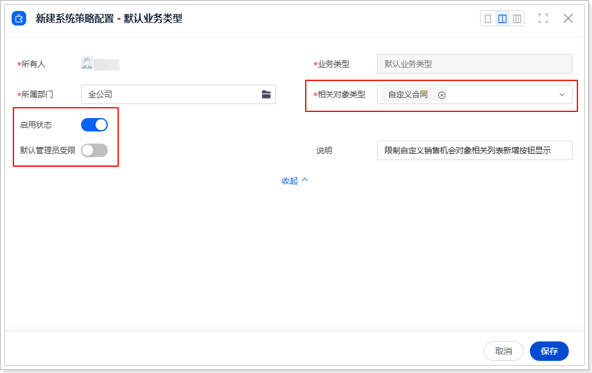
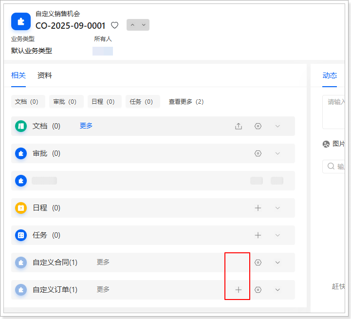
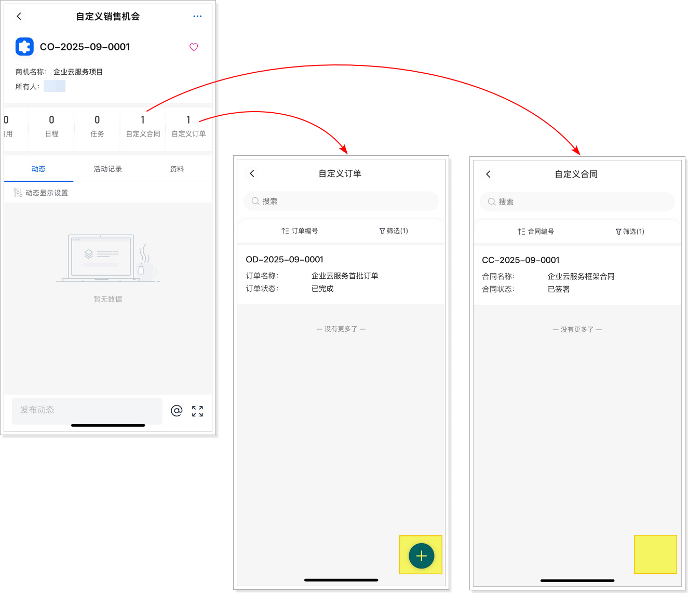

# 验证与测试
1.  设置限制数据（如果系统策略配置对象中已经存在一条数据，可以跳过此步骤）。

    1.  在网页端，进入**系统策略配置**列表页。

    2.  新建一条数据，并设置限制内容（本示例中的设置仅用于展示后续效果），确保此处使用的配置数据的数据 ID 与代码中保持一致。

        !!! note

            如果通过授权码安装，在创建完数据后，请先修改网页端和移动端扩展代码中的数据 ID，修改方法请参考[扩展开发（网页端）](../../../../web/detail-page/dynamic-control/prevent-direct-contract-and-order-creation/extension-development.md)和[扩展开发（移动端）](extension-development.md)中的相关说明。

        

2.  在网页端或移动端，使用非默认管理员账户（如默认普通用户账户）登录系统。

3.  新建**自定义销售机会**数据。

    1.  进入**自定义销售机会**列表页。

    2.  新建一条数据。

4.  新建**自定义合同**数据。

    1.  进入**自定义合同**列表页。

    2.  新建一条数据，关联至刚刚创建的自定义销售机会数据。

5.  新建**自定义订单**数据。

    1.  进入**自定义订单**列表页。

    2.  新建一条数据，关联至刚刚创建的自定义销售机会数据。

6.  进入**自定义销售机会**列表页。

7.  找到新创建的数据并进入其详情页。

    

    
