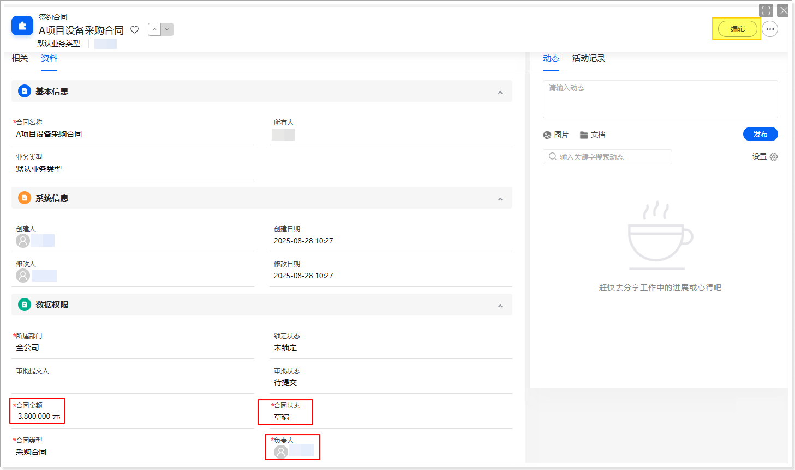
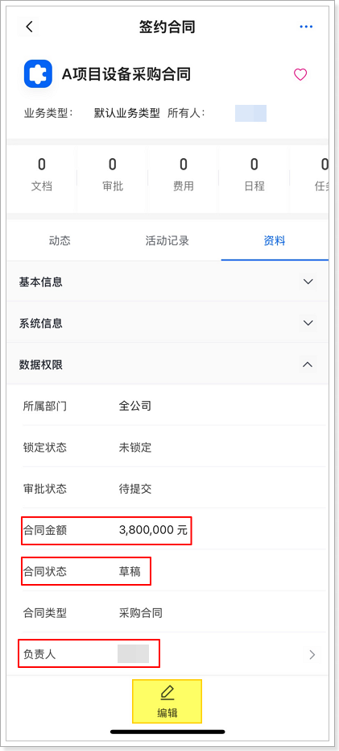
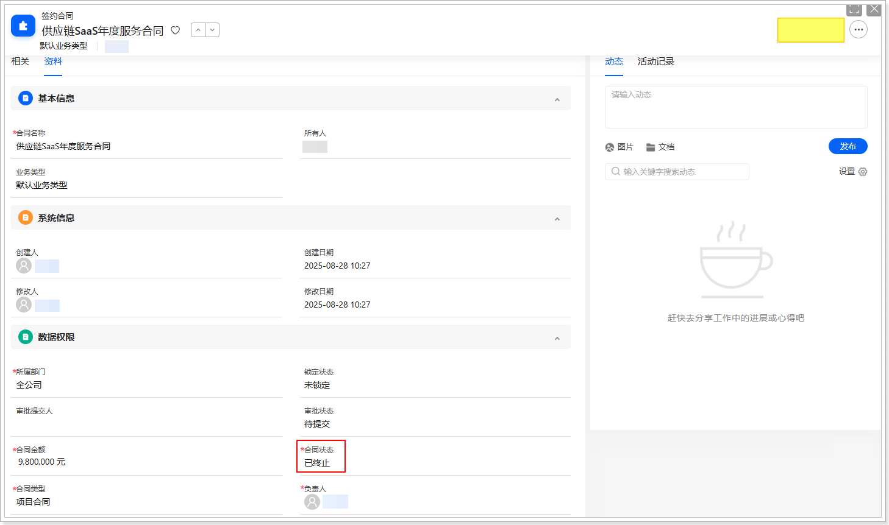
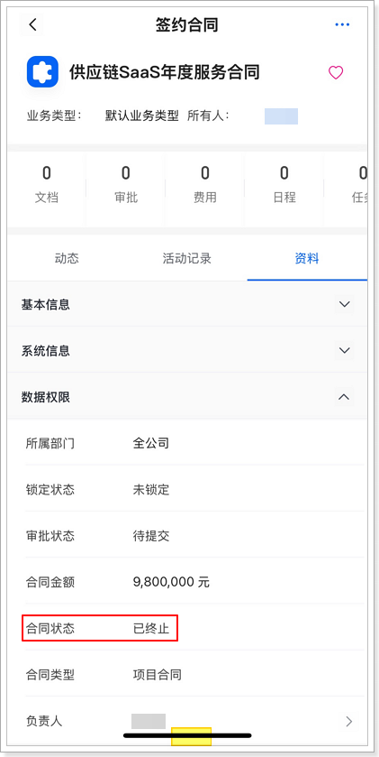
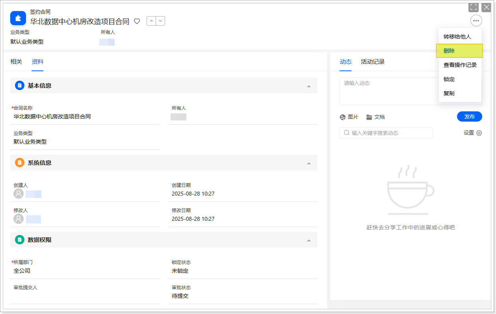
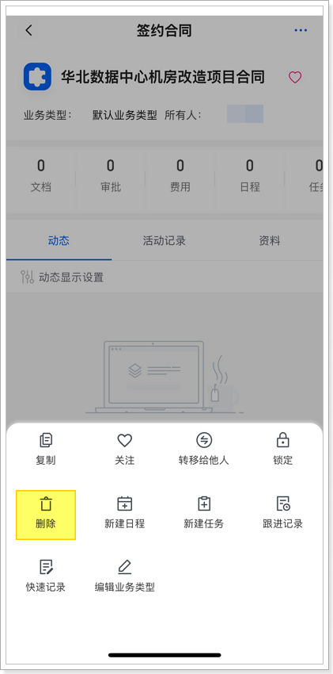
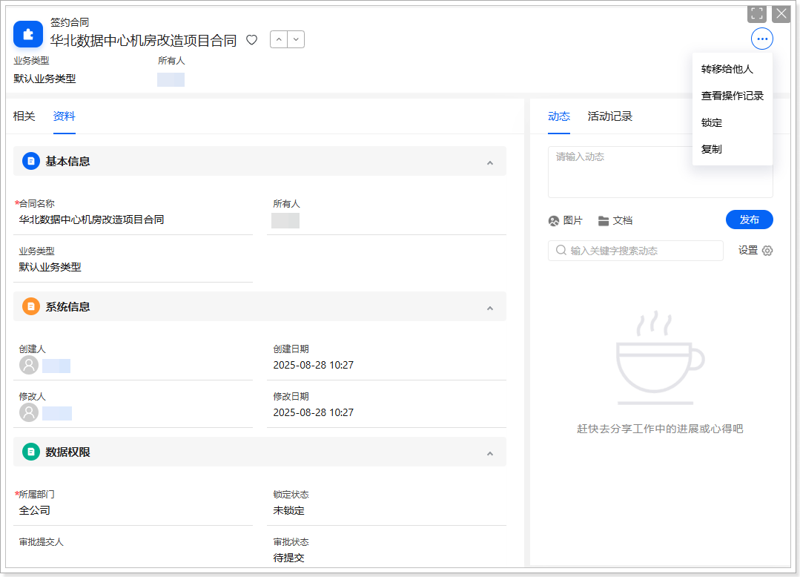
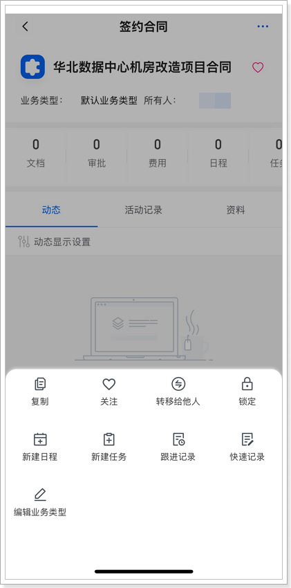

# 验证与测试
-   **测试编辑按钮**

    1.  在网页端或移动端，进入**签约合同**列表页。

    2.  新建一些数据，覆盖不同的合同状态和合同金额区间。

    3.  选择不同数据进入其详情页进行验证。

        -   **测试一：编辑按钮显示**

            当数据同时符合以下条件时，显示**编辑**按钮：

            -   **负责人**为当前登录用户。
            -   **合同状态**为草稿。
            -   **合同金额**小于等于 500 万。
            
            

            

        -   **测试二：编辑按钮隐藏**

            当数据**不**符合下面任一条件时，隐藏**编辑**按钮：

            -   **负责人**为当前登录用户。
            -   **合同状态**为草稿。
            -   **合同金额**小于等于 500 万。
            
            

            

        -   **测试删除按钮**

            1.  测试一：删除按钮显示

                以主要职能为**默认管理员**的用户身份登录系统，进入签约合同的详情页，应显示**删除**按钮。

                

                

            2.  测试二：删除按钮隐藏

                以主要职能为**非默认管理员**（如默认普通用户）的用户身份登录系统，进入签约合同的详情页，应隐藏**删除**按钮。

                

                
