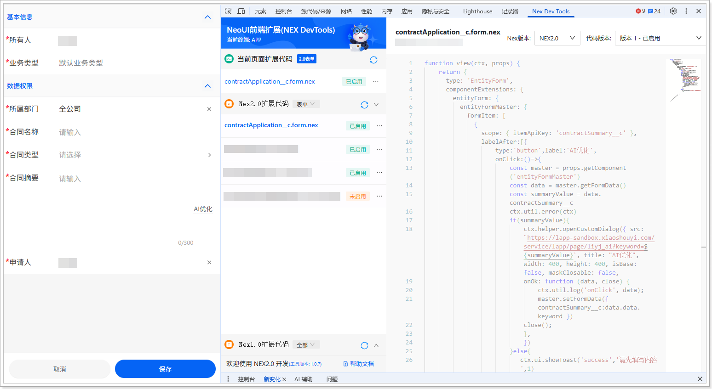

# 扩展开发（移动端）
遵循以下步骤，添加移动端扩展代码：
1.  在网页端，将系统域名后的访问路径替换为 /bff/neoh5\#/home。例如，域名为 https://crm-sandbox.xiaoshouyi.com，替换后的访问路径为：https://crm-sandbox.xiaoshouyi.com/bff/neoh5\#/home。

2.  进入**合同申请单**列表页。

3.  单击 ，打开新建页面。

4.  打开开发者工具（F12 或者鼠标右击页面的任意位置并在快捷菜单中单击**检查**），然后切换到 **Nex Dev Tools** 页签。

5.  单击**新建扩展代码**。

6.  将自动生成的代码全部替换为以下代码：

    代码替换后，请将代码中的 https://lapp-sandbox.xiaoshouyi.com/service/lapp/page/liyj\_ai 请根据页面代码部署的实际环境进行替换，页面代码地址查看方法请参考[将页面添加到销售易系统中](https://doc.xiaoshouyi.com/?sso-domain=login.xiaoshouyi.com#/proMan/workplaceDetail?url=%2F%2Ftasks%2FdevelopmentPlatform_pageDevelopment_integrateCustomPages_addPageToSystem.html&id=1436&dir=output_1758873199342&time=1762847450139&proId=1015&checkStat=undefined)的**查看页面访问地址**部分。

    ```javascript
    function view(ctx, props) {
    return {
    type: 'EntityForm',
    componentExtensions: {
    entityForm: {
    entityFormMaster: {
    formItem: [
    {
    scope: { itemApiKey: 'contractSummary__c' },
    labelAfter:[{
    type:'button',label:'AI优化',
    onClick:()=>{
    const master = props.getComponent('entityFormMaster')
    const data = master.getFormData()
    const summaryValue = data.contractSummary__c
    ctx.util.error(ctx)
    if(summaryValue){
    ctx.helper.openCustomDialog({ src: `https://lapp-sandbox.xiaoshouyi.com/service/lapp/page/liyj_ai?keyword=${summaryValue}`, title: "AI优化", width: 400, height: 400, isBase: false, maskClosable: false, 
    onOk: function (data, close) { 
    ctx.util.log('onClick', data);
    master.setFormData({ contractSummary__c:data.data.keyword }) 
    close();
    }, 
    })
    }else{
    ctx.ui.showToast('success','请先填写内容',1)
    }
                          
    }
    }]
    }
    ]
    }
    }
    }
    }
    }
    ```

7.  单击**保存**，然后单击**启用**。

    
