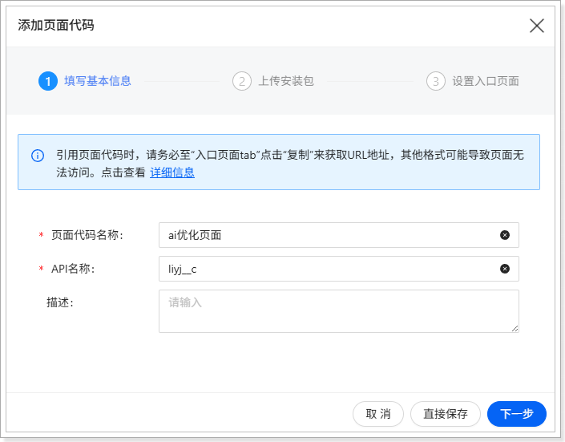
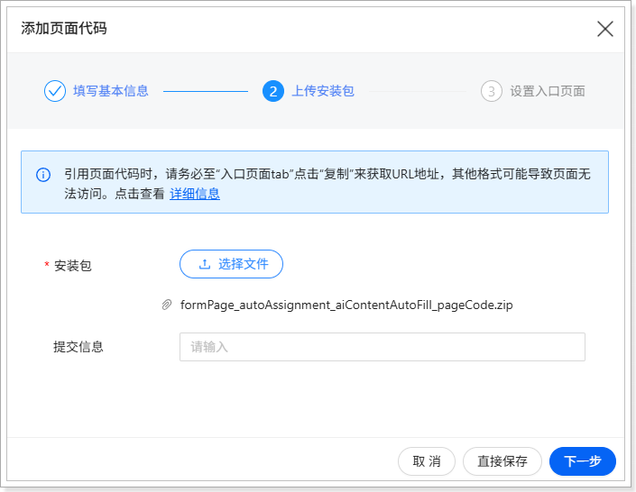
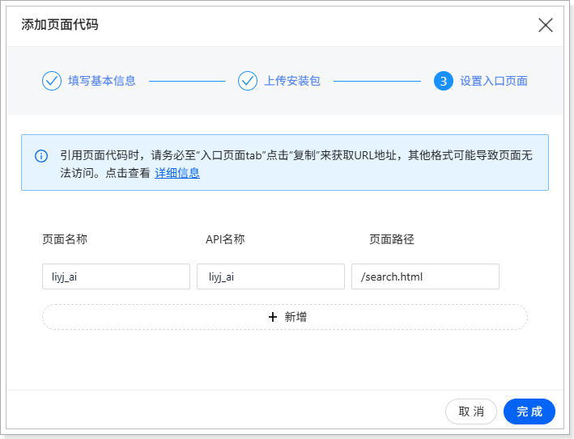

# 前提条件
以下前提条件仅为案例演示所需，实际请以您系统中的具体配置为准。

1.  系统中必须存在下表所示的对象及相应字段。

    | 对象名称 | API 名称 | 字段类型 | 字段名称 | API 名称 | 其他说明 |
    | --- | --- | --- | --- | --- | --- |
    | 合同申请单 | contractApplication | 自动编号 | 合同编号 | name | 
主属性字段

显示格式：HT-{YYYY}-{MM}-{0000}
 |
    |  |  | 文本 | 合同名称 | contractName | 必填 |
    |  |  | 单选 | 合同类型 | contractType | 选项值：<ul><li>采购合同
APICODE：1

API 名称：purchaseContract
</li><li>销售合同
APICODE：2

API 名称：salesContract
</li></ul> |
    |  |  | 文本 | 合同摘要 | contractSummary | 必填 |
    |  |  | 关联关系 | 申请人 | applicant | 
关联标准对象“用户”，默认值为当前登录用户

必填
 |
    
2.  系统中必须上传并启用“AI 优化结果”页面的页面代码。

    下载示例代码请单击：[下载代码](https://xsy-docs-1253467224.cos.ap-beijing.myqcloud.com/docCenter/examplesUsedInProductManual/PaaS/NEX2.0%E6%A1%88%E4%BE%8B/%E8%A1%A8%E5%8D%95%E9%A1%B5/%E8%87%AA%E5%8A%A8%E8%B5%8B%E5%80%BC%E7%B1%BB/AI%E5%86%85%E5%AE%B9%E4%BC%98%E5%8C%96%E5%9B%9E%E5%A1%AB/formPage_autoAssignment_aiContentAutoFill_001/formPage_autoAssignment_aiContentAutoFill_pageCode.zip)。

    将下载的示例代码配置到系统中并启用代码。此处仅展示页面代码的关键配置内容，关于页面代码的完整配置方法，请参考[将页面添加到销售易系统中](https://doc.xiaoshouyi.com/?sso-domain=login.xiaoshouyi.com#/proMan/workplaceDetail?url=%2F%2Ftasks%2FdevelopmentPlatform_pageDevelopment_integrateCustomPages_addPageToSystem.html&id=1436&dir=output_1758873199342&time=1760582908318&proId=1015&checkStat=undefined)。

    

    

    
