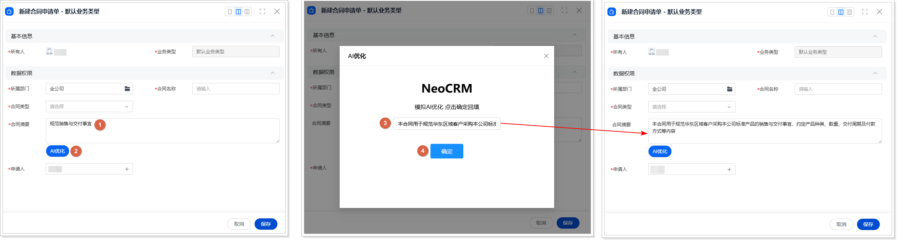
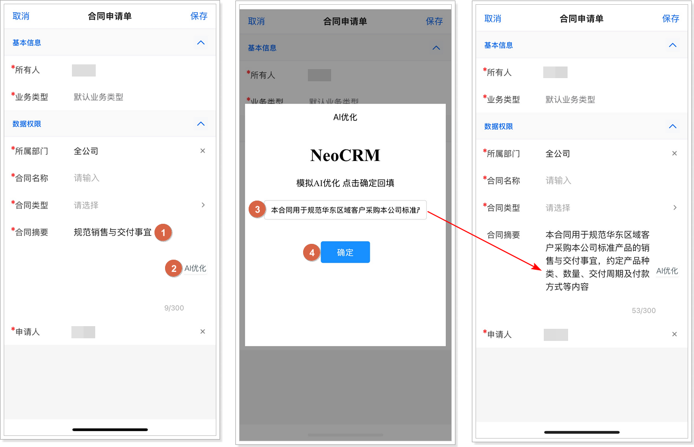

# 验证与测试
!!! note

    如果通过授权码安装，在测试前请先根据实际环境修改移动端扩展代码中的页面代码地址，修改方法请参考[扩展开发（移动端）](extension-development.md)中的相关说明。

1.  在网页端或移动端，进入**合同申请单**列表页。

2.  打开新建合同申请单页面。

3.  填写**合同摘要**字段，然后单击**AI 优化**。

    本案例在实现过程中模拟了 AI 接口返回的优化内容。弹出页面的文本框中应展示优化后的内容，但示例中暂时原样显示了**合同摘要**字段的内容。可在文本框中手动修改内容，单击**确定**后，最新修改内容将自动回填至**合同摘要**字段中。

    

    
