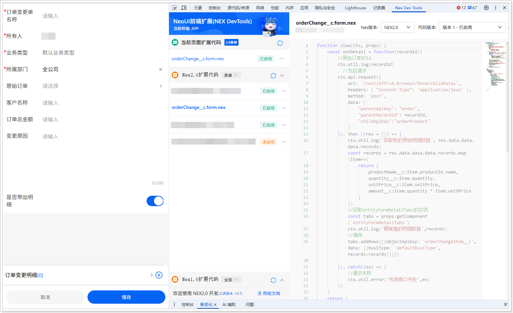

# 扩展开发（移动端）
遵循以下步骤，添加移动端扩展代码：
1.  在网页端，将系统域名后的访问路径替换为 /bff/neoh5\#/home。例如，域名为 https://crm-sandbox.xiaoshouyi.com，替换后的访问路径为：https://crm-sandbox.xiaoshouyi.com/bff/neoh5\#/home。

2.  进入**订单变更单**列表页。

3.  单击 ，打开新建页面。

4.  打开开发者工具（F12 或者鼠标右击页面的任意位置并在快捷菜单中单击**检查**），然后切换到 **Nex Dev Tools** 页签。

5.  单击**新建扩展代码**。

6.  将自动生成的代码全部替换为以下代码：

    ```javascript
    function view(ctx, props) {
    const setDetail = function(recordId){
    //原始订单的id
    ctx.util.log(recordId)
    //发起请求
    ctx.api.request({
    url: '/rest/bff/v4.0/neoui/form/childDatas',
    headers: { "Content-Type": 'application/json' },
    method: 'post',
    data: {
    "parentApiKey": "order",
    "parentRecordId": recordId,
    "childApiKey":"orderProduct"
    }
    }). then ((res = {}) => {
    ctx.util.log('获取到的原始明细数据', res.data.data.data.records)
    const records = res.data.data.data.records.map(item=>{
    return {
    productName__c:item.productId.name,
    quantity__c:item.quantity,
    unitPrice__c:item.unitPrice,
    amount__c:item.quantity * item.unitPrice
    }
    })
    //获取entityFormDetailTabs的实例
    const tabs = props.getComponent('entityFormDetailTabs')
    ctx.util.log('要赋值的明细数据',records)
    //调用
    tabs.addRows([{objectApiKey: 'orderChangeItem__c',data: [{busiType: 'defaultBusiType', records:records}]}])
                 
    }). catch((ex) => {
    //请求失败
    ctx.util.error('权限接口失败',ex)
    })
    }
    return {
    type: 'EntityForm',
    componentExtensions: {
    entityForm: {
    entityFormMaster: {
    formItem: [
    {
    scope: { itemApiKey: 'originalOrder__c' },
    label: '原始订单',
    onChange: function (e) {
    ctx.util.error(e)
    //获取当前字段的值
    const value = e.data.value
    //获取字段实例
    const fieldInstance = e.cmp
    //通过字段实例批量设置当前数据的字段值
    fieldInstance.setFormData({ accountName__c: value.accountId.name,totalAmount__c:value.amount })
    //判断是否带出子明细
    const isCopyItems = e.data.record.copyItems__c == 1
    if(isCopyItems){
    //获取并新增子明细
    setDetail(value.id)
    }
    }
    }
    ]
    }
    }
    }
    }
    }
    ```

7.  单击**保存**，然后单击**启用**。

    
