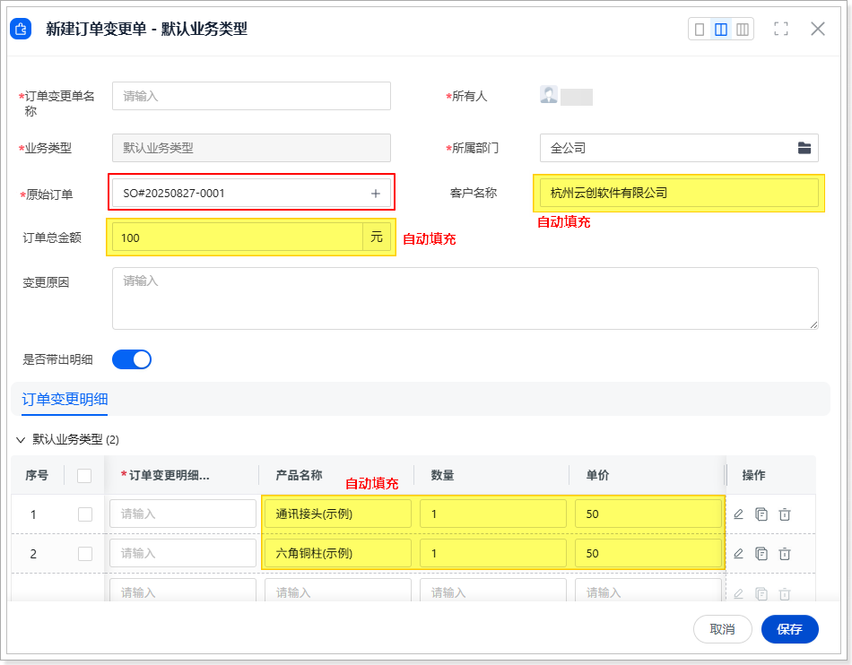
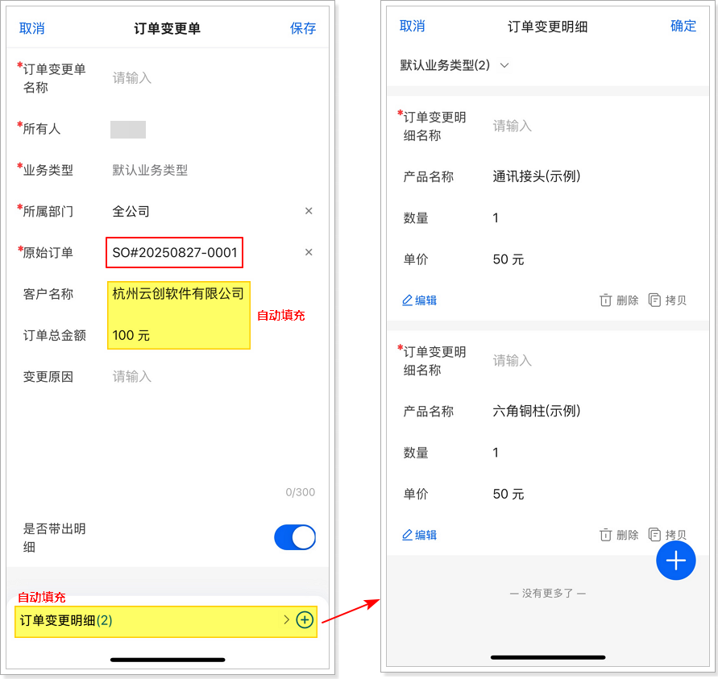

# 验证与测试
1.  在标准对象**客户**上新建至少一条数据。（如果客户中已有数据，可忽略此步骤）

2.  在标准对象**产品**上新建至少一条数据。（如果产品中已有数据，可忽略此步骤）

3.  在标准对象**订单**上新建一条数据（关联特定客户并确保添加产品）。（如果订单中已有数据，可忽略此步骤）

4.  在网页端或移动端，进入**订单变更单**列表页。

5.  打开新建订单变更单页面。

6.  填写**原始订单**字段。

    填写**原始订单**字段后，系统自动获取并填充**客户名称**、**订单总金额**及订单明细数据。

    

    
