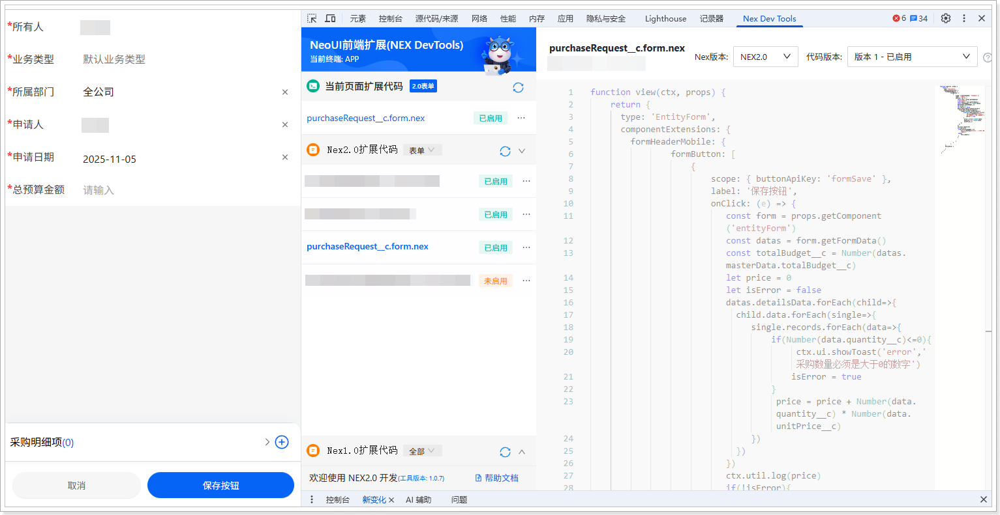

# 扩展开发（移动端）
遵循以下步骤，添加移动端扩展代码：
1.  在网页端，将系统域名后的访问路径替换为 /bff/neoh5\#/home。例如，域名为 https://crm-sandbox.xiaoshouyi.com，替换后的访问路径为：https://crm-sandbox.xiaoshouyi.com/bff/neoh5\#/home。

2.  进入**采购申请单**列表页。

3.  单击 ，打开新建页面。

4.  打开开发者工具（F12 或者鼠标右击页面的任意位置并在快捷菜单中单击**检查**），然后切换到 **Nex Dev Tools** 页签。

5.  单击**新建扩展代码**。

6.  将自动生成的代码全部替换为以下代码：

    ```javascript
    function view(ctx, props) {
    return {
    type: 'EntityForm',
    componentExtensions: {
    formHeaderMobile: {
    formButton: [
    {
    scope: { buttonApiKey: 'formSave' },
    label: '保存按钮',
    onClick: (e) => {
    const form = props.getComponent('entityForm')
    const datas = form.getFormData()
    const totalBudget__c = Number(datas.masterData.totalBudget__c)
    let price = 0
    let isError = false
    datas.detailsData.forEach(child=>{
    child.data.forEach(single=>{
    single.records.forEach(data=>{
    if(Number(data.quantity__c)<=0){
    ctx.ui.showToast('error','采购数量必须是大于0的数字')
    isError = true
    }
    price = price + Number(data.quantity__c) * Number(data.unitPrice__c)
    })
    })
    })
    ctx.util.log(price)
    if(!isError){
    if(price>totalBudget__c){
    ctx.ui.showToast('error','总价超出预算金额')
    }else{
    form.submit()
    }
    }
                              
                            
    }
    }
    ],
    },
    entityForm: {
    
    }
    }
    }
    }
    ```

7.  单击**保存**，然后单击**启用**。

    
