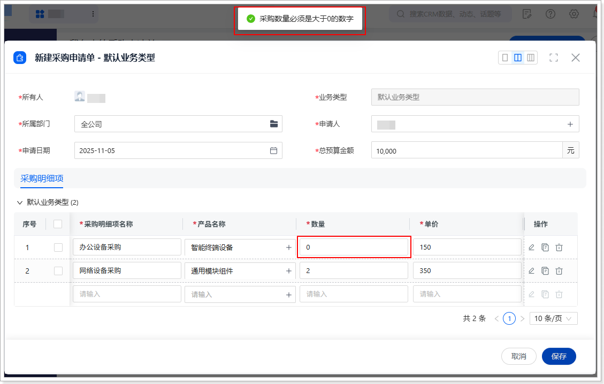
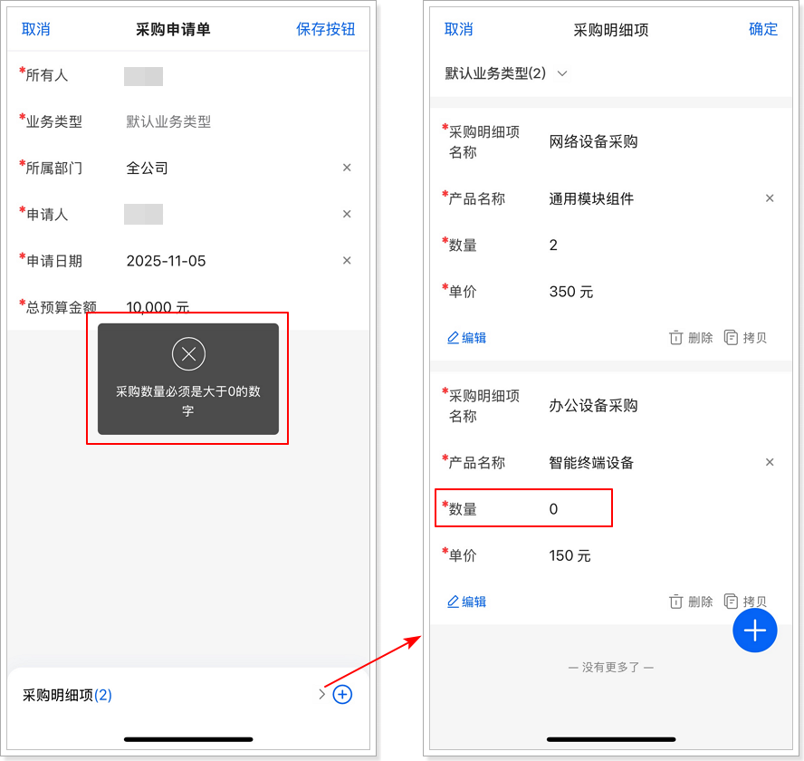
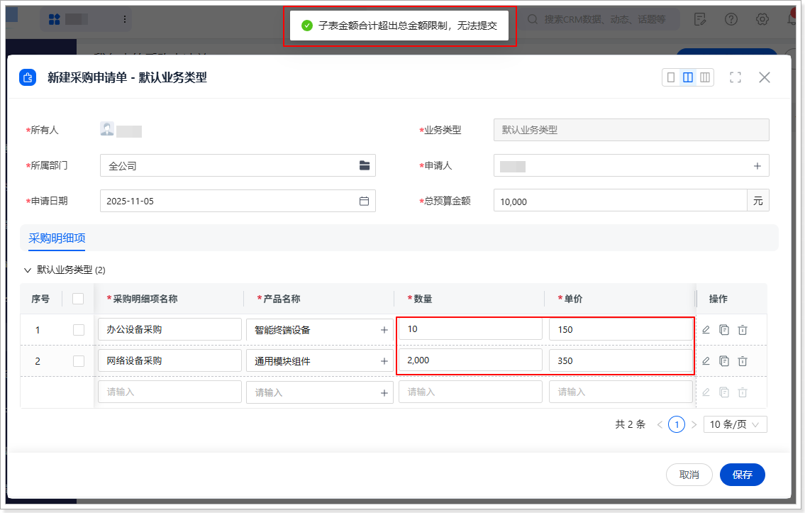
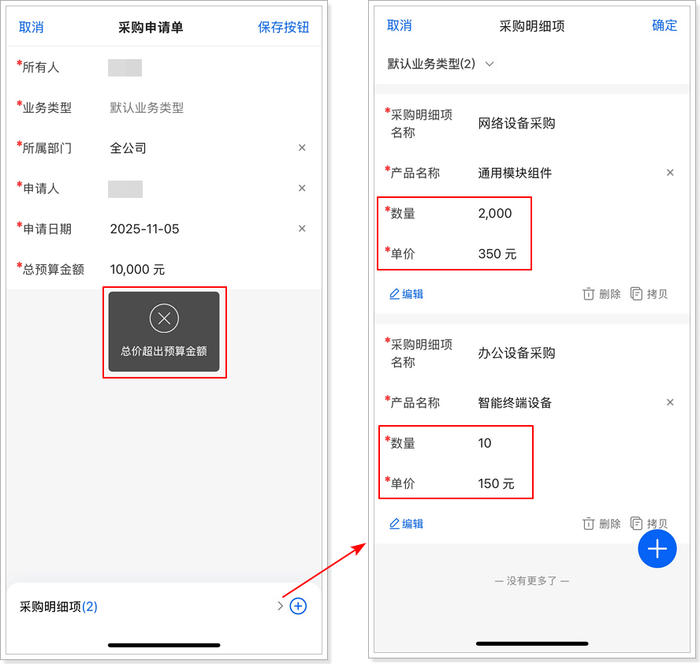

# 验证与测试
1.  在标准对象**产品**上新建至少一条数据。（如果产品中已有数据，可忽略此步骤）

2.  在网页端或移动端，进入采购申请单列表页。

3.  打开新建采购申请单页面。

4.  在**新建采购申请单**页面，填写**总预算金额**、**采购明细项名称**、**产品名称**、**数量**和**单价**。

    -   测试一：数量为 0

    将某条明细的**数量**填写为 0，然后单击**保存**，系统应提示**采购数量必须是大于0的数字**，数据不保存。

    

    

    -   测试二：明细总金额大于总预算金额

    当所有明细数据的“单价 × 数量”之和大于**总预算金额**时，系统应提示**子表金额合计超出总金额限制，无法提交**，数据不保存。

    

    
