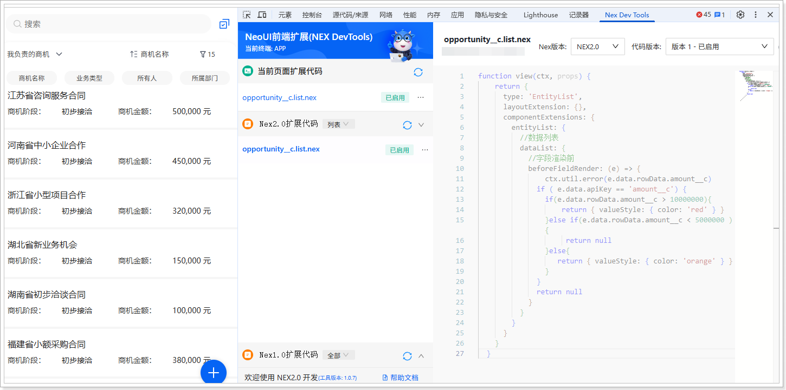

# 扩展开发（移动端）
遵循以下步骤，添加移动端扩展代码：
1.  在网页端，将系统域名后的访问路径替换为 /bff/neoh5\#/home。例如，域名为 https://crm-sandbox.xiaoshouyi.com，替换后的访问路径为：https://crm-sandbox.xiaoshouyi.com/bff/neoh5\#/home。

2.  进入**商机**列表页。

3.  打开开发者工具（F12 或者鼠标右击页面的任意位置并在快捷菜单中单击**检查**），然后切换到 **Nex Dev Tools** 页签。

4.  单击**新建扩展代码**。

5.  将自动生成的代码全部替换为以下代码：

    ```javascript
    function view(ctx, props) {
    return {
    type: 'EntityList',
    layoutExtension: {},
    componentExtensions: {
    entityList: {
    //数据列表
    dataList: {
    //字段渲染前
    beforeFieldRender: (e) => {
    ctx.util.error(e.data.rowData.amount__c)
    if ( e.data.apiKey == 'amount__c') {
    if(e.data.rowData.amount__c > 10000000){
    return { valueStyle: { color: 'red' } }
    }else if(e.data.rowData.amount__c < 5000000 ){
    return null
    }else{
    return { valueStyle: { color: 'orange' } }
    }
    }
    return null
    }
    }
    }
    }
    }
    }
    ```

6.  单击**保存**，然后单击**启用**。

    
