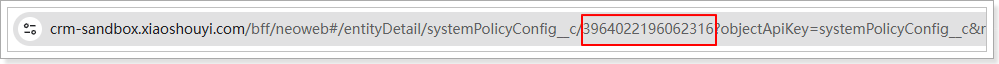
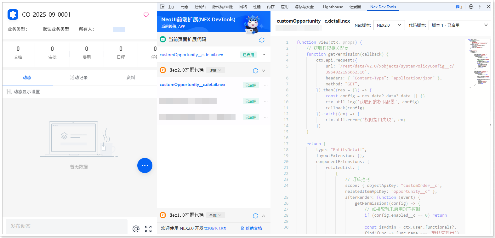

# 扩展开发（移动端）
遵循以下步骤，添加移动端扩展代码：
1.  在网页端，将系统域名后的访问路径替换为 /bff/neoh5\#/home。例如，域名为 https://crm-sandbox.xiaoshouyi.com，替换后的访问路径为：https://crm-sandbox.xiaoshouyi.com/bff/neoh5\#/home。

2.  进入**自定义销售机会**列表页。

3.  选择一条数据，并单击进入其详情页。

4.  打开开发者工具（F12 或者鼠标右击页面的任意位置并在快捷菜单中单击**检查**），然后切换到 **Nex Dev Tools** 页签。

5.  单击**新建扩展代码**。

6.  将自动生成的代码全部替换为以下代码：

    代码中的 /rest/data/v2.0/xobjects/systemPolicyConfig\_\_c/3964022196062316 中的“3964022196062316”是配置数据的 ID，需根据实际情况进行替换。在“系统策略配置”对象列表页中双击数据的主属性字段，然后在打开页面的地址栏中查看该数据的 ID。（如果系统策略配置对象中没有数据，，请参考[验证与测试](nex2DevelopmentCases_detailPage_dynamicControl_preventDirectContractAndOrderCreation_validationTesting.md)中的第一步先创建数据）

    

    ```javascript
    function view(ctx, props) {
    // 获取权限相关配置
    function getPermission(callback) {
    ctx.api.request({
    url: '/rest/data/v2.0/xobjects/systemPolicyConfig__c/3964022196062316',
    headers: { "Content-Type": "application/json" },
    method: "GET",
    }).then((res = {}) => {
    const config = res.data?.data?.data || {}
    ctx.util.log('获取到的权限配置', config)
    callback(config)
    }).catch((ex) => {
    ctx.util.error('权限接口失败', ex)
    })
    }
    
    return {
    type: "EntityDetail",
    layoutExtension: {},
    componentExtensions: {
    relatedList: [
    {
    // 订单控制
    scope: { objectApiKey: "customOrder__c", relatedItemApiKey: "opportunity__c" },
    afterRender: function (event) {
    getPermission((config) => {
    // 如果配置未启用则不控制
    if (config.enabled__c == 0) return
    
    const isAdmin = ctx.user.functionals?.find(func => func.name === '默认管理员')
    // 默认管理员不受限制
    if (isAdmin && config.defaultAdminRestricted__c == 0) return
    
    const isOrder = config?.relatedType__c?.find(value=> value == 2)
    if (isOrder) {
    const listButton = event.cmp.getComponent('listButton', { buttonApiKey: 'create' })
    listButton?.setAttributes({visible:false})
    }
    })
    }
    },
    {
    // 合同控制
    scope: { objectApiKey: "customContract__c", relatedItemApiKey: "opportunity__c" },
    afterRender: function (event) {
    getPermission((config) => {
    // 如果配置未启用则不控制
    if (config.enabled__c == 0) return
    
    const isAdmin = ctx.user.functionals?.find(func => func.name === '默认管理员')
    if (isAdmin && config.defaultAdminRestricted__c == 0) return
    
    const isContract = config?.relatedType__c?.find(value=> value == 1)
    if (isContract) {
    const listButton = event.cmp.getComponent('listButton', { buttonApiKey: 'create' })
    listButton?.setAttributes({visible:false})
    }
    })
    }
    }
    ]
    }
    }
    }
    ```

7.  单击**保存**，然后单击**启用**。

    
