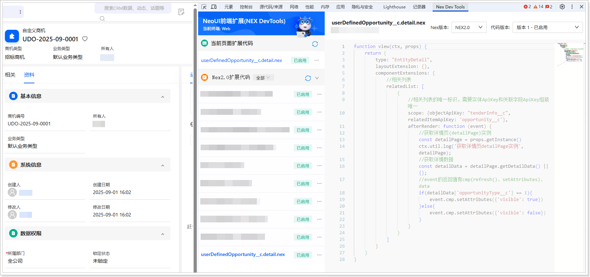

# 扩展开发（网页端）
遵循以下步骤，添加网页端扩展代码：
1.  在系统前台，进入**自定义商机**列表页。

2.  双击数据主属性名称的方式打开详情页（非侧滑形式）。

3.  打开开发者工具（F12 或者鼠标右击页面的任意位置并在快捷菜单中单击**检查**），然后切换到 **Nex Dev Tools** 页签。

4.  单击**新建扩展代码**。

5.  将自动生成的代码全部替换为以下代码：

    ```javascript
    function view(ctx, props) {
    return {
    type: "EntityDetail",
    layoutExtension: {},
    componentExtensions: {
    //相关列表
    relatedList: [
    {
    //相关列表的唯一标识，需要实体ApiKey和关联字段ApiKey组装唯一
    scope: {objectApiKey: "tenderInfo__c", relatedItemApiKey: 'opportunity__c'},
    afterRender: function (event) {
    //获取详情页(detailPage)实例
    const detailPage = props.getInstance()
    ctx.util.log('获取详情页detailPage实例', detailPage);
    //获取详情数据
    const detailData = detailPage.getDetailData() || {};
    //event的返回值有cmp(refresh()、setAttributes)、data
    if(detailData['opportunityType__c'] == 1){
    event.cmp.setAttributes({'visible': true})
    }else{
    event.cmp.setAttributes({'visible': false})
    }
    }
    }
    ]
    }
    }
    }
    ```

6.  单击**保存**，然后单击**启用**。

    
