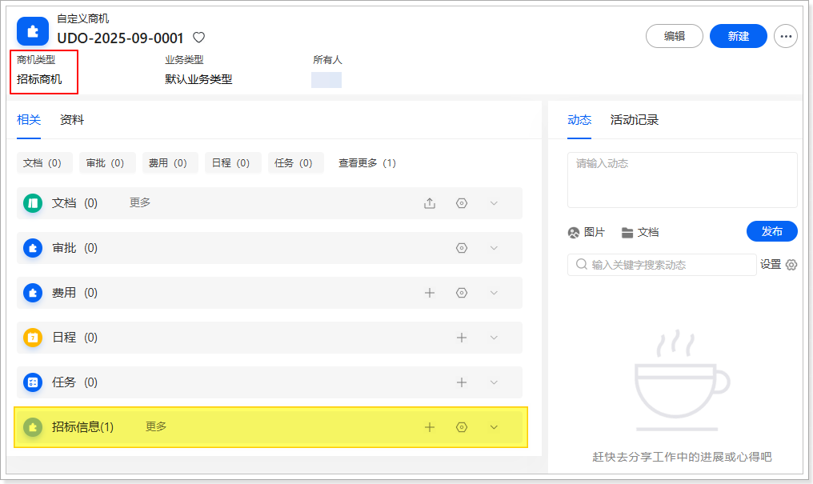
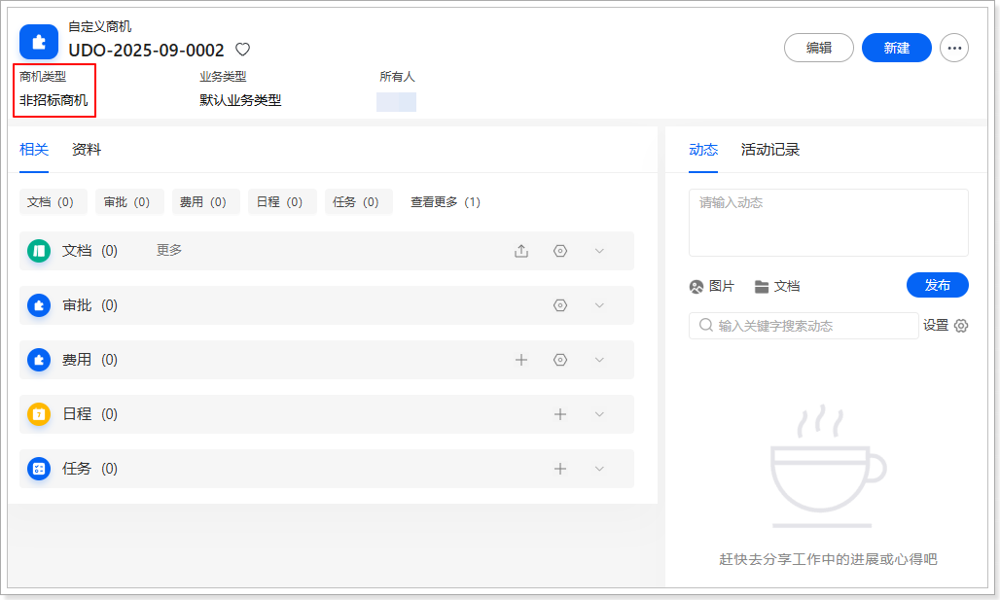

# 验证与测试
本案例目前仅支持网页端，以下操作均在网页端进行：

1.  新建**自定义商机**数据。

    1.  进入**自定义商机**列表页。

    2.  新建两条数据，分别设置**商机类型**为“招标商机”和“非招标商机”。

2.  新建**招标信息**数据。

    1.  进入**招标信息**列表页。

    2.  新建两条数据，分别关联至刚刚创建的两条自定义商机数据。

3.  进入**自定义商机**列表页，然后选择不同商机类型的数据进入其详情页。

    -   当商机类型为**招标商机**时，相关列表中应显示**招标信息**。

        

    -   当商机类型为**非招标商机**时，相关列表中应隐藏**招标信息**。

        
