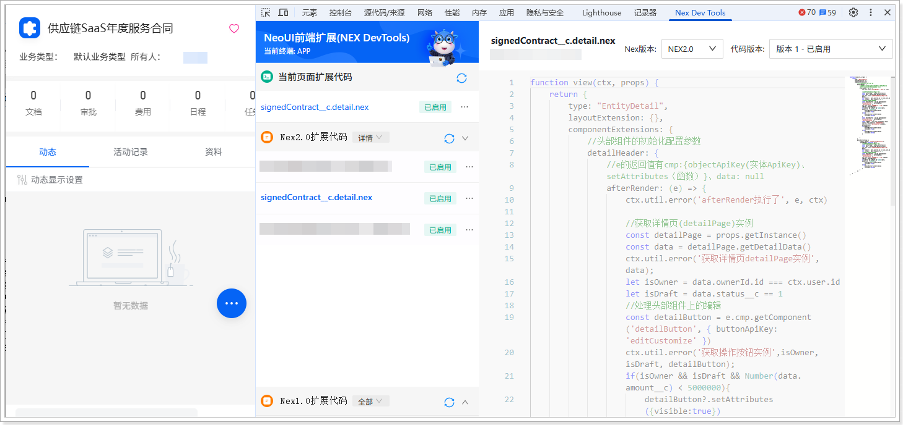

# 扩展开发（移动端）
遵循以下步骤，添加移动端扩展代码：
1.  在网页端，将系统域名后的访问路径替换为 /bff/neoh5\#/home。例如，域名为 https://crm-sandbox.xiaoshouyi.com，替换后的访问路径为：https://crm-sandbox.xiaoshouyi.com/bff/neoh5\#/home。

2.  进入**签约合同**列表页。

3.  选择一条数据，并单击进入其详情页。

4.  打开开发者工具（F12 或者鼠标右击页面的任意位置并在快捷菜单中单击**检查**），然后切换到 **Nex Dev Tools** 页签。

5.  单击**新建扩展代码**。

6.  将自动生成的代码全部替换为以下代码：

    ```javascript
    function view(ctx, props) {
    return {
    type: "EntityDetail",
    layoutExtension: {},
    componentExtensions: {
    //头部组件的初始化配置参数
    detailHeader: {
    //e的返回值有cmp:{objectApiKey(实体ApiKey)、setAttributes（函数）}、data: null
    afterRender: (e) => {
    ctx.util.error('afterRender执行了', e, ctx)
     
    //获取详情页(detailPage)实例
    const detailPage = props.getInstance()
    const data = detailPage.getDetailData()
    ctx.util.error('获取详情页detailPage实例', data);
    let isOwner = data.ownerId.id === ctx.user.id
    let isDraft = data.status__c == 1
    //处理头部组件上的编辑
    const detailButton = e.cmp.getComponent('detailButton', { buttonApiKey: 'editCustomize' })
    ctx.util.error('获取操作按钮实例',isOwner, isDraft, detailButton);
    if(isOwner && isDraft && Number(data.amount__c) < 5000000){
    detailButton?.setAttributes({visible:true})
    }else{
    detailButton?.setAttributes({visible:false})
    }
    const deleteButton = e.cmp.getComponent('detailButton', { buttonApiKey: 'deleteCustomize' })
    const isAdmin = ctx.user.functionals.find(func=> func.name === '默认管理员')
    ctx.util.error('deleteButton',isAdmin, deleteButton);
    if(isAdmin){
    deleteButton?.setAttributes({visible:true})
    }else{
    deleteButton?.setAttributes({visible:false})
    }
                        
                         
    }
    },
    quickButtonGroup:[{
    scope:{ apiKey: 'xsyShortCutButton_13'},
    afterRender: function (e) {
    //获取详情页(detailPage)实例
    const detailPage = props.getInstance()
    const data = detailPage.getDetailData()
    ctx.util.error('获取详情页detailPage实例', data);
    let isOwner = data.ownerId.id === ctx.user.id
    let isDraft = data.status__c == 1
    //处理头部组件上的编辑
    const detailButton = e.cmp.getComponent('detailButton', { buttonApiKey: 'editCustomize' })
    ctx.util.error('获取操作按钮实例',isOwner, isDraft, detailButton);
    if(isOwner && isDraft && Number(data.amount__c) < 5000000){
    detailButton?.setAttributes({visible:true})
    }else{
    detailButton?.setAttributes({visible:false})
    }
    }
    }]
    }
    }
    }
    ```

7.  单击**保存**，然后单击**启用**。

    
