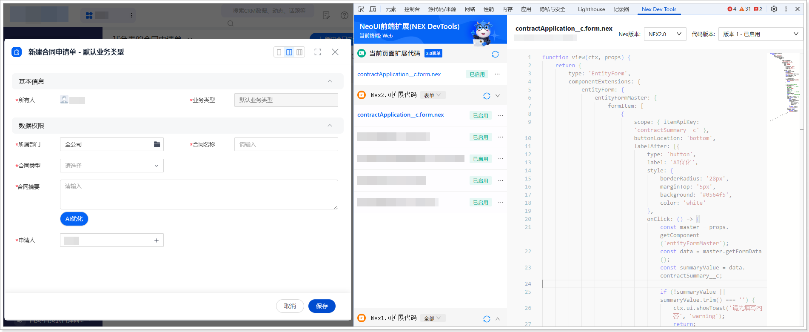

# 扩展开发（网页端）
遵循以下步骤，添加网页端扩展代码：
1.  在系统前台，进入**合同申请单**列表页。

2.  单击**新建合同申请单**，打开新建页面。

3.  打开开发者工具（F12 或者鼠标右击页面的任意位置并在快捷菜单中单击**检查**），然后切换到 **Nex Dev Tools** 页签。

4.  单击**新建扩展代码**。

5.  将右侧自动生成的代码全部替换为以下代码：

    ```javascript
    function view(ctx, props) {
    return {
    type: 'EntityForm',
    componentExtensions: {
    entityForm: {
    entityFormMaster: {
    formItem: [
    {
    scope: { itemApiKey: 'contractSummary__c' },
    buttonLocation: 'bottom',
    labelAfter: [{
    type: 'button',
    label: 'AI优化',
    style: {
    borderRadius: '28px',
    marginTop: '5px',
    background: '#0564f5',
    color: 'white'
    },
    onClick: () => {
    const master = props.getComponent('entityFormMaster');
    const data = master.getFormData();
    const summaryValue = data.contractSummary__c;
    
    if (!summaryValue || summaryValue.trim() === '') {
    ctx.ui.showToast('请先填写内容', 'warning');
    return;
    }
    
    // 调用内部页面
    ctx.ui.openIframe({
    devPageKey: 'liyj_ai',       // 内部页面 API Key
    title: 'AI优化',
    width: 600,
    height: 400,
    showFooter: false,           // 不显示默认底部按钮
    showCloseButton: true,       // 显示右上角关闭按钮
    urlParams: { keyword: summaryValue }, // 传递参数
    onOk: function (retData, close) {
    const newValue = retData?.data?.keyword;
    if (newValue) {
    master.setFormData({ contractSummary__c: newValue });
    }
    if (typeof close === 'function') close();
    },
    onCancel: function (retData, close) {
    if (typeof close === 'function') close();
    }
    });
    }
    }]
    }
    ]
    }
    }
    }
    };
    }
    ```

6.  单击**保存**，然后单击**启用**。

    
