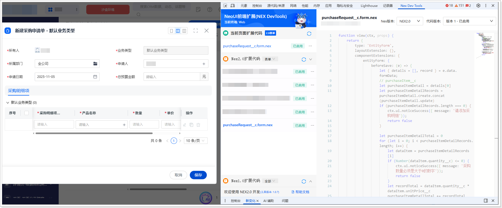

# 扩展开发（网页端）
遵循以下步骤，添加网页端扩展代码：
1.  在系统前台，进入**采购申请单**列表页。

2.  单击**新建采购申请单**，打开新建页面。

3.  打开开发者工具（F12 或者鼠标右击页面的任意位置并在快捷菜单中单击**检查**），然后切换到 **Nex Dev Tools** 页签。

4.  单击**新建扩展代码**。

5.  将自动生成的代码全部替换为以下代码：

    ```javascript
    function view(ctx, props) {
    return {
    type: 'EntityForm',
    layoutExtension: {},
    componentExtensions: {
    entityForm: {
    beforeSave: (e) => {
    let { details = [], record } = e.data.formData;
    // purchaseItem__c
    let purchaseItemDetail = details[0]
    let purchaseItemDetailRecords = purchaseItemDetail.create.concat(purchaseItemDetail.update)
    if (purchaseItemDetailRecords.length === 0) {
    ctx.ui.noticeSuccess({ message: '请添加采购明细'});
    return false
    }
    
    let purchaseItemDetailTotal = 0
    for (let i = 0; i < purchaseItemDetailRecords.length; i++) {
    let dataItem = purchaseItemDetailRecords[i]
    if (Number(dataItem.quantity__c) <= 0) {
    ctx.ui.noticeSuccess({ message: '采购数量必须是大于0的数字'});
    return false
    }
    let recordTotal = dataItem.quantity__c * dataItem.unitPrice__c
    purchaseItemDetailTotal += recordTotal
    }
    
    if (purchaseItemDetailTotal > record.totalBudget__c) {
    ctx.ui.noticeSuccess({ message: '子表金额合计超出总金额限制，无法提交'});
    return false
    }
    return true
    
    }
    }
    }
    }
    }
    ```

6.  单击**保存**，然后单击**启用**。

    
