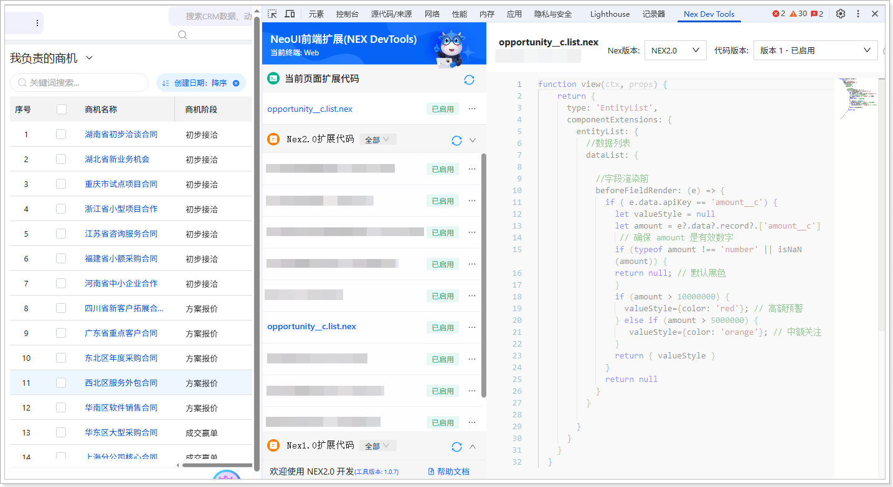

# 扩展开发（网页端）
遵循以下步骤，添加网页端扩展代码：
1.  在系统前台，进入**商机**列表页。

2.  打开开发者工具（F12 或者鼠标右击页面的任意位置并在快捷菜单中单击**检查**），然后切换到 **Nex Dev Tools** 页签。

3.  单击**新建扩展代码**。

4.  将自动生成的代码全部替换为以下代码：

    ```javascript
    function view(ctx, props) {
    return {
    type: 'EntityList',
    componentExtensions: {
    entityList: {
    //数据列表
    dataList: {
    
    //字段渲染前
    beforeFieldRender: (e) => {
    if ( e.data.apiKey == 'amount__c') {
    let valueStyle = null
    let amount = e?.data?.record?.['amount__c']
    // 确保 amount 是有效数字
    if (typeof amount !== 'number' || isNaN(amount)) {
    return null; // 默认黑色
    }
    if (amount > 10000000) {
    valueStyle={color: 'red'}; // 高额预警
    } else if (amount > 5000000) {
    valueStyle={color: 'orange'}; // 中额关注
    } 
    return { valueStyle }
    }
    return null
    }
    }
    
    }
    }
    }
    }
    ```

5.  单击**保存**，然后单击**启用**。

    
