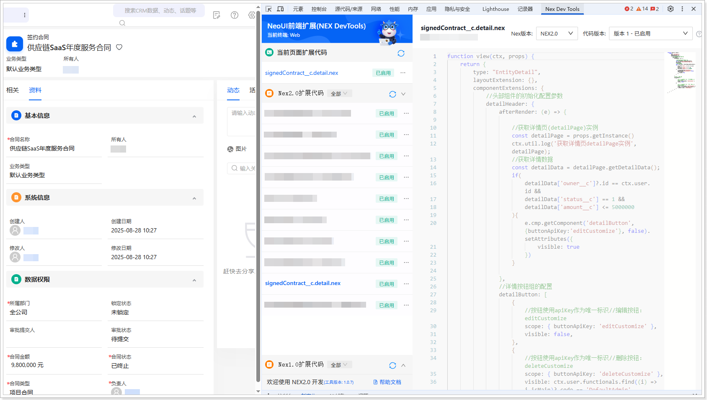

# 扩展开发（网页端）
遵循以下步骤，添加网页端扩展代码：
1.  在系统前台，进入**签约合同**列表页。

2.  双击数据主属性名称的方式打开详情页（非侧滑形式）。

3.  打开开发者工具（F12 或者鼠标右击页面的任意位置并在快捷菜单中单击**检查**），然后切换到 **Nex Dev Tools** 页签。

4.  单击**新建扩展代码**。

5.  将自动生成的代码全部替换为以下代码：

    ```javascript
    function view(ctx, props) {
    return {
    type: "EntityDetail",
    layoutExtension: {},
    componentExtensions: {
    //头部组件的初始化配置参数
    detailHeader: {
    afterRender: (e) => {
     
    //获取详情页(detailPage)实例
    const detailPage = props.getInstance()
    ctx.util.log('获取详情页detailPage实例', detailPage);
    //获取详情数据
    const detailData = detailPage.getDetailData();
    if(
    detailData['owner__c']?.id == ctx.user.id && 
    detailData['status__c'] == 1 &&
    detailData['amount__c'] <= 5000000 
    ){
    e.cmp.getComponent('detailButton', {buttonApiKey:'editCustomize'}, false).setAttributes({
    visible: true
    })
    }
                         
    },
    //详情按钮组的配置
    detailButton: [
    {
    //按钮使用apiKey作为唯一标识//编辑按钮：editCustomize
    scope: { buttonApiKey: 'editCustomize' },
    visible: false,
    },
    {
    //按钮使用apiKey作为唯一标识//删除按钮：deleteCustomize
    scope: { buttonApiKey: 'deleteCustomize' },
    visible: ctx.user.functionals.find((i) => i.isMain)?.code == 'DefaultAdmin',
    }
    ],
    }
    }
    }
    }
    ```

6.  单击**保存**，然后单击**启用**。

    
