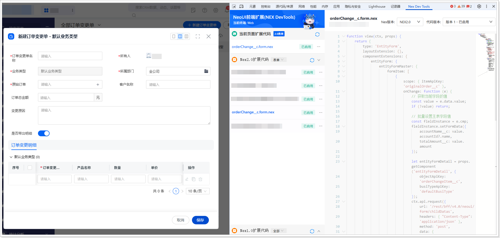

# 扩展开发（网页端）
遵循以下步骤，添加网页端扩展代码：
1.  在系统前台，进入**订单变更单**列表页。

2.  单击**新建订单变更单**，打开新建页面。

3.  打开开发者工具（F12 或者鼠标右击页面的任意位置并在快捷菜单中单击**检查**），然后切换到 **Nex Dev Tools** 页签。

4.  单击**新建扩展代码**。

5.  将自动生成的代码全部替换为以下代码：

    ```javascript
    function view(ctx, props) {
    return {
    type: 'EntityForm',
    layoutExtension: {},
    componentExtensions: {
    entityForm: {
    entityFormMaster: {
    formItem: [
    {
    scope: { itemApiKey: 'originalOrder__c' },
    onChange: function (e) {
    // 获取当前字段的值
    const value = e.data.value;
    if (!value) return;
    
    // 批量设置主表字段值
    const fieldInstance = e.cmp;
    fieldInstance.setFormData({
    accountName__c: value.accountId?.name,
    totalAmount__c: value.amount
    });
    								
    let entityFormDetail = props.getComponent('entityFormDetail', {
    objectApiKey: 'orderChangeItem__c',
    busiTypeApiKey: 'defaultBusiType'
    });
    ctx.api.request({
    url: '/rest/bff/v4.0/neoui/form/childDatas',
    headers: { "Content-Type": 'application/json' },
    method: 'post',
    data: {
    parentApiKey: "order",
    parentRecordId: e.data.value.id,
    childApiKey: "orderProduct"
    }
    }).then(res => {
    const records = res.data.data.data.records.map(item => ({
    accountName__c: value.accountId?.name,
    totalAmount__c: value.amount,                                       
    productName__c: item.productId.name,
    quantity__c: item.quantity,
    unitPrice__c: item.unitPrice,
    amount__c: item.quantity * item.unitPrice
    }));
    if (entityFormDetail && records && records.length) {
    entityFormDetail.api.setRowData(records)
    }
    
    })
    }
    }
    ]
    }
    }
    }
    }
    }
    ```

6.  单击**保存**，然后单击**启用**。

    
